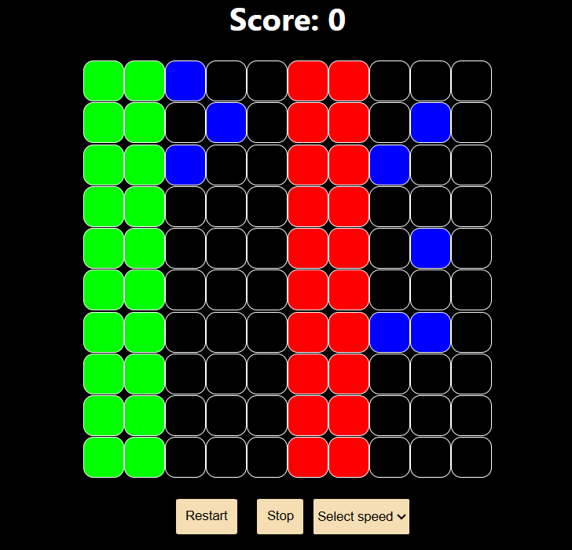

# Colorful-Tile
Colorful-Tile - It is one of the tasks in Round 1 of the FOG Tech Challenge. The objective is to build a colorful tile game using React.js for the frontend and Node.js for the backend.

### Task Completed:
1. Created a 10x10 Grid with animating red color tile and blue tile
2. Implemented logic of Blue Cell generation (grid patterns) in the backend and integrated in frontend by calling custom API
3. Added a start and stop button. Reset score when the game is started.
4. Added an option to control the speed of the animation. From 1-5 (250ms-50ms).
5. Display score, +10 for clicking on blue tile, and -10 for clicking on red tile.
6. Quickly blink the tile 3 times when it’s clicked.

## Follow below steps to test
Deployed link: [here](https://colorful-tile-game-pb.netlify.app/)

Or 

For Frontend:
cd colorful-tile-game
npm install
npm start

For Backend:
cd backend
npm install
nodemon index.js

## Image

For any queries contact me at borade.keshav825@gmail.com
